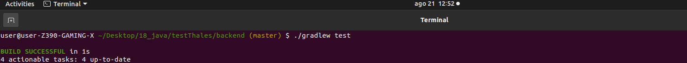
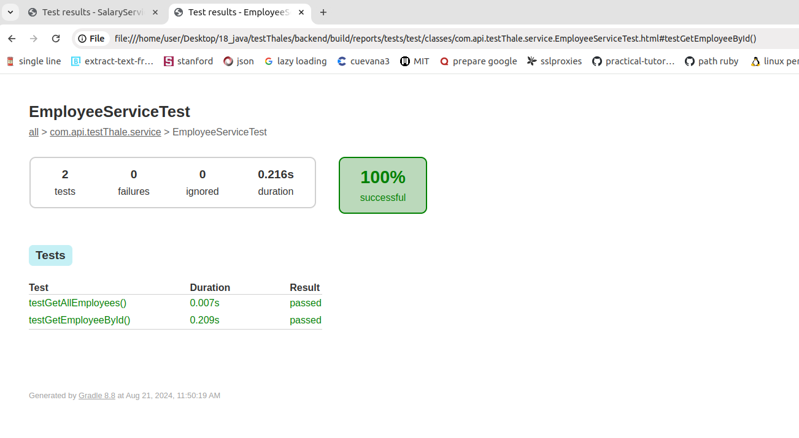
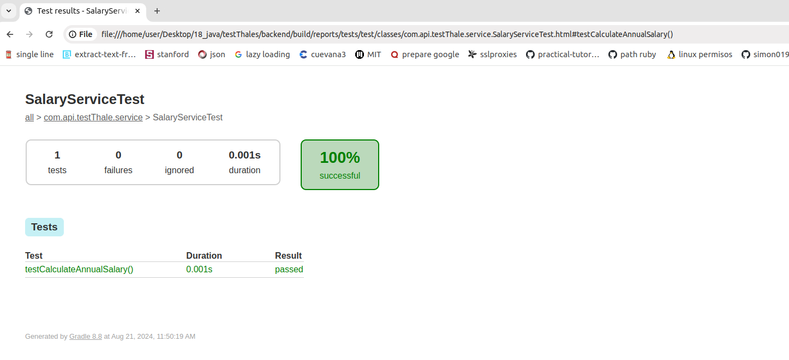

# TestThale Project

## Backend Description

The Spring Boot backend manages employees through an API that allows listing all employees and getting specific details of an employee by ID, including annual salary calculation if available.

## Stack

- openjdk 17.0.12 2024-07-16
- Java 17
- Gradle 8.8

### Clone repo

```bash
# Clone repo
$ git git@github.com:WilliamPerezBeltran/pruebaThales.git

# Go to app directory
$ cd pruebaThales

# Go to backend folder
$ cd backend

```
### Run app

```bash
# install dependencies 
$ ./gradlew build

# Run app
$ ./gradlew bootRun
```

### Run test

```bash
# run test
$ ./gradlew test
```

### Run app widnow 
```bash
$ gradlew.bat bootRun
```

## Project Structure

```bash
├── build.gradle
├── gradlew
├── gradlew.bat
├── HELP.md
├── README.md
├── settings.gradle
├── assets
└── src
    ├── main
    │   ├── java
    │   │   └── com
    │   │       └── api
    │   │           └── testThale
    │   │               ├── config
    │   │               │   ├── AppConfig.java
    │   │               │   └── WebConfig.java
    │   │               ├── controller
    │   │               │   └── EmployeeController.java
    │   │               ├── model
    │   │               │   ├── Employee.java
    │   │               │   ├── EmployeeListResponse.java
    │   │               │   └── EmployeeResponse.java
    │   │               ├── service
    │   │               │   ├── EmployeeService.java
    │   │               │   └── SalaryService.java
    │   │               └── TestThaleApplication.java
    │   └── resources
    │       ├── application.properties
    │       ├── static
    │       └── templates
    └── test
        └── java
            └── com
                └── api
                    └── testThale
                        ├── service
                        │   ├── EmployeeServiceTest.java
                        │   └── SalaryServiceTest.java
                        └── TestThaleApplicationTests.java

```

### Backend (Spring Boot)

- **build.gradle**: Gradle configuration.
- **src/main/java/com/api/testThale**:
  - **config**:
    - `AppConfig.java`: Spring bean configuration.
    - `WebConfig.java`: Web configuration (if needed).
  - **controller**:
    - `EmployeeController.java`: Controller that handles HTTP requests for employees.
  - **model**:
    - `Employee.java`: Data model for employees.
    - `EmployeeListResponse.java`: Response for the list of employees.
    - `EmployeeResponse.java`: Response for the details of an employee.
  - **service**:
    - `EmployeeService.java`: Service for consuming external employee APIs.
    - `SalaryService.java`: Service for calculating annual salary.
  - `TestThaleApplication.java`: Main class to run the Spring Boot application.
- **src/main/resources**:
  - `application.properties`: Spring Boot application configuration.
- **src/test/java/com/api/testThale**:
  - **service**:
    - `EmployeeServiceTest.java`: Unit tests for `EmployeeService`.
    - `SalaryServiceTest.java`: Unit tests for `SalaryService`.
  - `TestThaleApplicationTests.java`: Integration tests for the application.


## API Documentation

### Base URL

The base URL for the API is: `http://localhost:8080/api`

### Endpoints

#### 1. List Employees

- **Endpoint**: `/employees`
- **Method**: `GET`
- **Description**: Retrieves a list of all employees.
- **Response**: 
  - **Status Code**: `200 OK`
  - **Content-Type**: `application/json`
  - **Body**: A JSON array of employee objects, where each object contains the following fields:
    - `id`: Integer - Unique identifier of the employee.
    - `employee_name`: String - Name of the employee.
    - `employee_salary`: Number - Salary of the employee.
    - `employee_anual_salary`: Number - Calculated annual salary (salary x 12).

- **Example Request**:
```bash
	curl -X GET "http://localhost:8080/api/employees" -H "accept: application/json"
```

- **Example Request**:

```bash
[
  {
        "id": 1,
        "employee_name": "Tiger Nixon",
        "employee_salary": 320800.0,
        "annualSalary": 0.0
    },
    {
        "id": 2,
        "employee_name": "Garrett Winters",
        "employee_salary": 170750.0,
        "annualSalary": 0.0
    }
]
```


#### 2. Get Employee by ID

- **Endpoint**: `/employees/{id}`
- **Method**: `GET`
- **Description**: Retrieves detailed information for a specific employee identified by the `id` parameter.

#### Parameters

- **Path Parameter**:
  - `id`: Integer - The unique identifier of the employee to retrieve.

#### Response

- **Status Code**: 
  - `200 OK` if the employee is found
  - `404 Not Found` if the employee does not exist
- **Content-Type**: `application/json`
- **Body**: A JSON object containing the employee's details:
  - `id`: Integer - Unique identifier of the employee.
  - `name`: String - Name of the employee.
  - `salary`: Number - Salary of the employee.
  - `employee_anual_salary`: Number - Calculated annual salary (salary x 12).

#### Example Request

```bash
curl -X GET "http://localhost:8080/api/employees/1" -H "accept: application/json"
```

- **Example Request**:
```bash
{
    "id": 2,
    "employee_name": "Garrett Winters",
    "employee_salary": 170750.0,
    "annualSalary": 2049000.0
}
```

- **Error Responses**:
- `404 Not Found`: Returned when the requested resource does not exist.
```bash
{
  "error": "Employee not found"

```
- `500 Internal Server Error`: Returned when there is a server-side error processing the request.

```bash
{
  "error": "Internal server error"
}

```


#### Notes

- Ensure the backend server is running and accessible at [http://localhost:8080](http://localhost:8080) before making API requests.
- The API assumes a RESTful design and uses standard HTTP methods and status codes for communication.

#### Imagenes del Testing



