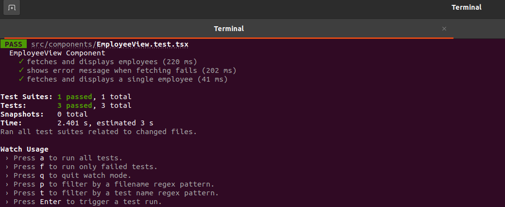
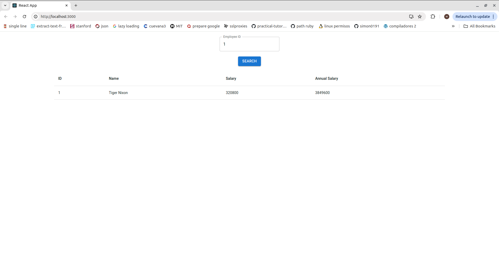

# Frontend - TestThale

## Description

The frontend of the TestThale project is built using React with TypeScript and Sass with Material Design. It provides a user interface for interacting with the backend API, allowing users to view and search employee information.

## Stack

- **react**: 18.3.1
- **node**: v18.6.0
- **typescript**: 4.9.5
- **mui/material**: 5.16.7",
- **sass**: v1.77.8
- **emotion**: 11.13.0

## Getting Started

### Clone the Repository

```bash
# Clone the repository
$ git clone git@github.com:WilliamPerezBeltran/pruebaThales.git

# Go to the project directory
$ cd pruebaThales

# Go to the frontend folder
$ cd frontend
```
### Run app

```bash
# install dependencies 
$ npm install

# Run app
$ npm start
```

### Run test

```bash
# run test
$ npm test or npm run test 
```

## Project Structure

```bash
├── babel.config.js
├── jest.config.js
├── package.json
├── package-lock.json
├── public
│   ├── index.html
│   ├── manifest.json
│   └── robots.txt
├── README.md
├── src
│   ├── App.scss
│   ├── App.tsx
│   ├── components
│   │   ├── EmployeeView.test.tsx
│   │   └── EmployeeView.tsx
│   ├── index.css
│   ├── index.tsx
│   ├── logo.svg
│   ├── react-app-env.d.ts
│   ├── reportWebVitals.ts
│   ├── setupTests.ts
│   └── styles
│       └── EmployeeView.scss
└── tsconfig.json


```

### Frontend (React con TypeScript y Sass)

- **src/assets/styles**:
  - `main.scss`: Main SCSS styles file..
- **src/components**:
  - `EmployeeList.tsx`: Component for listing employees.
  - `EmployeeDetail.tsx`: Component to display details of an employee.
- **public/index.html**: Main HTML file.


### Base URL

The base URL for interface: `http://localhost:3000/`


#### Testing images




